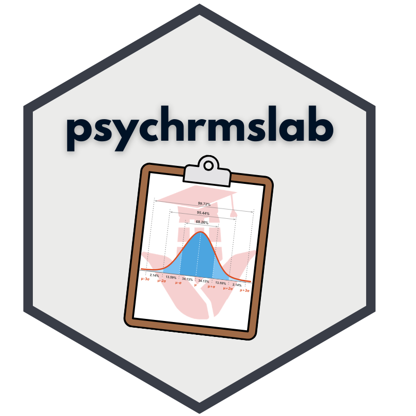

# psych350lab 

<!-- badges: start -->
<!-- badges: end -->

**psych350lab** provides helper functions for a Research Methods and Statistical Analysis lab course. It streamlines running common statistical analyses, generating APA-formatted tables, and creating interactive student worksheets — all from R and Quarto/RMarkdown.


## Installation

You can install **psych350lab** using the [`pak`](https://pak.r-lib.org/) package, which handles both CRAN and GitHub installations seamlessly.

### Install from GitHub (recommended)

To install you need to first set up GitHub authentication first.

#### Step 1: Configure GitHub credentials (one-time setup)
```r
# Install required packages if needed
install.packages(c("gitcreds", "usethis"))

# Check if credentials are already configured
gitcreds::gitcreds_get()

# If not configured, create a Personal Access Token:
usethis::create_github_token()  
# This opens GitHub with the correct scopes pre-selected.
# Generate the token, copy it, then run:

gitcreds::gitcreds_set()
# Paste your token when prompted
```

#### Step 2: Install the package
```r
pak::pak("emmarshall/psych350lab")
```

### Install from a local source

If you have a local copy of the package (e.g., a `.tar.gz` file or a cloned repo), you can install it with:
```r
# From a .tar.gz file
pak::pak("local::path/to/psych350lab_0.1.0.tar.gz")

# From a local directory
pak::pak("local::path/to/psych350lab")
```

### Troubleshooting authentication

If you encounter authentication errors:
```{r, eval = FALSE}
# Check your current GitHub configuration
usethis::git_sitrep()

# Reset and reconfigure credentials
gitcreds::gitcreds_set()
```

## Overview

The package is organized around several core analysis workflows, each with a computation function (`*_answers()`) and companion table/formatting functions.

### Data Import

| Function | Description |
|---|---|
| `get_spss_data()` | Read SPSS `.sav` files, convert missing values, and strip labels |
| `format_p_value()` | Format p-values in APA style (e.g., "< .001") |

### Correlation Analysis

| Function | Description |
|---|---|
| `corr_answers()` | Compute Pearson correlation with descriptives and hypothesis test |
| `create_corr_table()` | Compact flextable with r, p, df, means, SDs |
| `format_corr_results()` | Fill-in-the-blank or answer key text output |
| `create_apa_corr_table()` | APA correlation matrix with significance stars |
| `create_corr_matrix_checker()` | Interactive webexercise correlation matrix |

### Between-Groups ANOVA

| Function | Description |
|---|---|
| `bg_anova_answers()` | One-way between-groups ANOVA with group descriptives |
| `format_bg_anova_results()` | Fill-in-the-blank or answer key text |
| `create_bg_anova_table()` | APA descriptive statistics table |
| `create_anova_source_table()` | APA ANOVA source table (SS, df, MS, F, p) |
| `create_bg_anova_combined_table()` | Combined ANOVA + descriptives flextable |

### Within-Groups (Repeated Measures) ANOVA

| Function | Description |
|---|---|
| `wg_anova_answers()` | Repeated measures ANOVA for two conditions |
| `format_wg_anova_results()` | Fill-in-the-blank or answer key text |
| `create_wg_anova_table()` | APA descriptive statistics table |
| `create_wg_anova_combined_table()` | Combined ANOVA + descriptives flextable |

### Factorial (Two-Way) ANOVA

| Function | Description |
|---|---|
| `anova_factorial_answers()` | 2×2 factorial ANOVA via `jmv` with EMMs and post-hoc |
| `lsd_hsd_calculator()` | Compute LSD and HSD minimum mean differences |
| `check_factor_alignment()` | Diagnostic check for factor level ordering |

### Multiple Regression

| Function | Description |
|---|---|
| `regression_answers()` | Full regression with univariate, bivariate, and multivariate results plus interpretation categories (a–d) |
| `regression_model_statistics()` | Formatted model summary line (R, R², F, df, p) |
| `regression_model_evaluation()` | "Does the model work?" / "How well?" text |
| `create_regression_combined_table()` | Flextable with r, b, type, and result category per predictor |
| `regression_table_legend()` | Markdown legend for result categories |
| `regression_category_legend()` | Extended markdown legend |
| `create_correlation_interp_ft()` | Flextable with auto-generated correlation interpretations |
| `create_regression_weight_interp_ft()` | Flextable with regression weight interpretations |

#### Interactive Webexercise Checkers (for Quarto)

| Function | Description |
|---|---|
| `create_model_summary_checker()` | Fill-in-the-blank model summary (tinytable + webexercises) |
| `create_predictor_checker()` | Interactive predictor results table with MCQs |
| `create_correlation_interpretations()` | Interactive correlation interpretation table |
| `create_regression_weight_interpretations()` | Interactive regression weight interpretation table |

### SPSS-Style Plotting

| Function | Description |
|---|---|
| `theme_SPSS()` | Complete ggplot2 theme mimicking SPSS charts (modern or legacy) |
| `scale_color_SPSS()` | SPSS discrete color scale |
| `scale_fill_SPSS()` | SPSS discrete fill scale |
| `palette_SPSS()` | Get SPSS hex color codes directly |
| `SPSS_pal()` | Palette function factory for ggplot2 scales |
| `number_SPSS()` | Format axis numbers without thousands separators |

## Quick Examples

### Correlation
```r
library(psych350lab)
data(superman_data)

result <- corr_answers(superman_data, "clark_height_in", "rt_critics_score")
result$Correlation
result$Descriptives

# APA table
create_corr_table("RH1", c("clark_height_in", "rt_critics_score"), result)
```

### Between-Groups ANOVA
```r
result <- bg_anova_answers(superman_data, iv = "clark_grp", dv = "rt_critics_score")
result$ANOVA
result$Descriptives

# Formatted results (answer key)
cat(format_bg_anova_results("RH1", c("clark_grp", "rt_critics_score"),
  result, iv_labels = c("Under 6ft", "6ft+")))
```

### Multiple Regression
```r
sm <- superman_data[!is.na(superman_data$rt_critics_score) &
                    !is.na(superman_data$rt_audience_score), ]

result <- regression_answers(
  data = sm,
  criterion = "rt_critics_score",
  quant_predictors = c("clark_height_in", "rt_audience_score"),
  quant_labels = c("Clark Height (in)", "Audience Score"),
  criterion_label = "Critics Score"
)

result$Model
result$Regression_Weights

# Combined predictor table
create_regression_combined_table(result, KEY = TRUE)
```

### SPSS-Style Plot
```r
library(ggplot2)

ggplot(mtcars, aes(x = factor(cyl), y = mpg, fill = factor(cyl))) +
  geom_boxplot() +
  scale_fill_SPSS() +
  theme_SPSS(scale.x = "discrete") +
  labs(x = "Cylinders", y = "MPG")
```

## Answer Key vs. Student Worksheet

Most table and formatting functions include a `Key` (or `KEY`) argument. Set `Key = TRUE` for a filled answer key, or `Key = FALSE` for a blank student worksheet — making it easy to generate both versions from the same code.
```r
# Answer key
cat(format_bg_anova_results("RH1", vars, result, iv_labels = labels, Key = TRUE))

# Student worksheet
cat(format_bg_anova_results("RH1", vars, result, iv_labels = labels, Key = FALSE))
```

## Interactive Webexercises (Quarto)

Several functions generate interactive fill-in-the-blank and multiple-choice tables powered by [`webexercises`](https://psyteachr.github.io/webexercises/) and [`tinytable`](https://vincentarelbundock.github.io/tinytable/). These are designed for use in Quarto HTML documents:
```r
# In a Quarto document
create_model_summary_checker(result)
create_predictor_checker(result)
```

## Sample Data

The package includes `superman_data`, a dataset used throughout the examples and course materials.
```r
data(superman_data)
str(superman_data)
```
